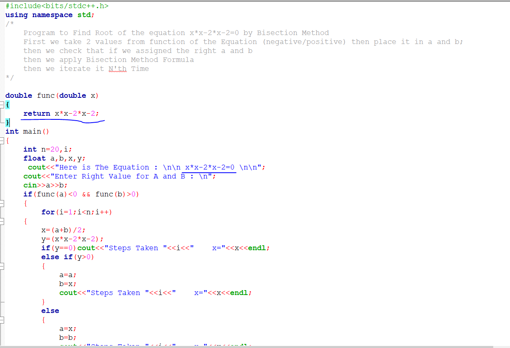
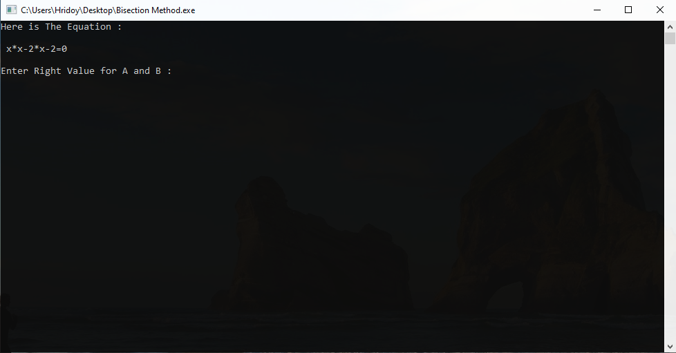
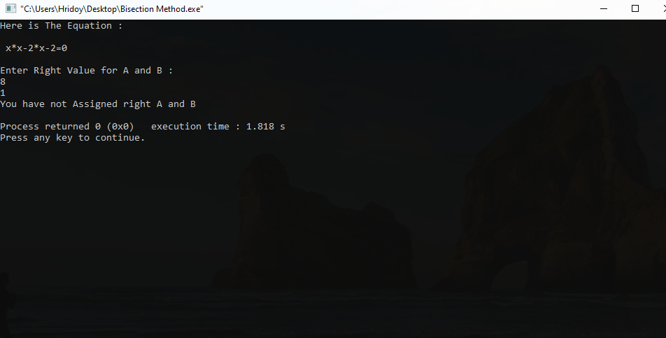
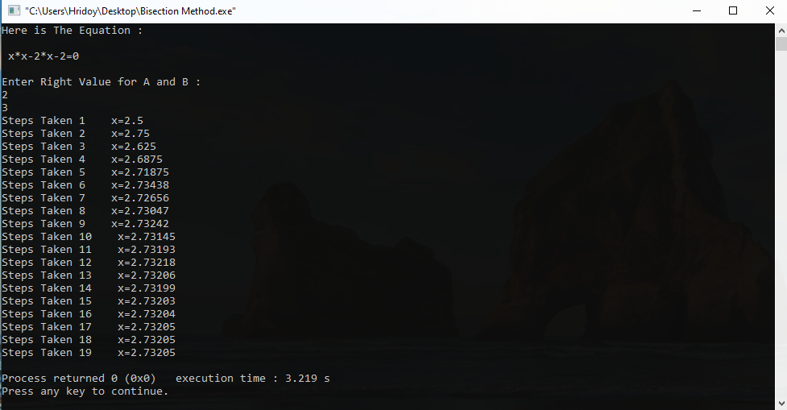

<h3 align="center" > Numerical Methods/Analysis </h1>

### Course Summary
Numerical Methods Is Very Interesting Mathmatics CSE Course. You'll Get This Course In 2nd Year.In This Course You'll Learn Different Method of Finding Roots of An Equation.

### Codes For Accuracy 
Root Finding Methods Calculation Is very Complex and Calculation Become Huges Sometimes.So You'll Get Lot of Mistakes and Errors While Calculating.But By Using Codes your calculation will be accurate and mistake will be reducted.

### Where To Learn
[I Learned From This Playlist](https://www.youtube.com/watch?v=hoJw1d-AMjw&list=PLhSp9OSVmeyJdYAHtIbDlkBLG0G1wuosk)
[And This](https://www.youtube.com/watch?v=_3i6oqQoukw&list=PLgH5QX0i9K3oKFrSOo4Kwns1-vTZmKQ7z)

### ScreenShorts

  <b>If you want to change equation then change value in marked place</b> 
    
   <b> Enter Input</b> 
    
    <b> Invalid Input</b> 
    
    <b> HomePage</b> 
    

